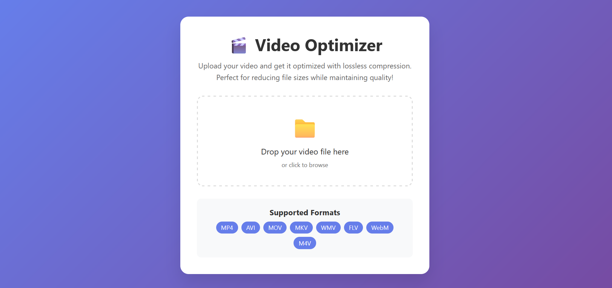

# Video Optimizer - Lossless Compression Web App



## Tech Stack


### Additional Technologies
- **H.264 Codec** - Video compression standard
- **AAC Audio** - Audio compression
- **UUID** - Unique file identification
- **Threading** - Background processing
- **Subprocess** - FFmpeg integration

A modern web application for optimizing video files with lossless compression. Perfect for reducing file sizes while maintaining visual quality.

## Features

- 🎬 **Drag & Drop Upload**: Easy file upload with drag-and-drop interface
- 🔄 **Real-time Progress**: Live progress tracking during optimization
- 📊 **File Size Comparison**: Shows original vs optimized file sizes
- 🎯 **Lossless Compression**: Uses H.264 with CRF 18 for visually lossless quality
- 📱 **Responsive Design**: Works on desktop and mobile devices
- 🗂️ **Multiple Formats**: Supports MP4, AVI, MOV, MKV, WMV, FLV, WebM, M4V
- ⚡ **Background Processing**: Non-blocking video optimization
- 🧹 **Auto Cleanup**: Automatically removes old files

## Installation

### Prerequisites

1. **Python 3.7+** installed on your system
2. **FFmpeg** installed and available in your PATH

### Install FFmpeg

#### Ubuntu/Debian:
```bash
sudo apt update
sudo apt install ffmpeg
```

#### macOS (using Homebrew):
```bash
brew install ffmpeg
```

#### Windows:
Download from [FFmpeg official website](https://ffmpeg.org/download.html) or use Chocolatey:
```bash
choco install ffmpeg
```

### Install Python Dependencies

1. Clone or download this repository
2. Navigate to the project directory
3. Install Python dependencies:

```bash
pip install -r requirements.txt
```

## Usage

### Starting the Application

1. Run the Flask application:
```bash
python app.py
```

2. Open your web browser and go to:
```
http://localhost:5000
```

### Using the Application

1. **Upload Video**: Drag and drop your video file onto the upload area or click to browse
2. **Monitor Progress**: Watch the real-time progress bar and status updates
3. **Download Result**: Once optimization is complete, click the download button to get your optimized video

### Optimization Settings

The application uses the following FFmpeg settings for optimal compression:

- **Video Codec**: H.264 (libx264)
- **Preset**: veryslow (best compression)
- **CRF**: 18 (visually lossless quality)
- **Audio Codec**: AAC
- **Audio Bitrate**: 128k
- **Web Optimization**: Fast start enabled

## File Structure

```
optimiser/
├── app.py              # Main Flask application
├── requirements.txt    # Python dependencies
├── README.md          # This file
├── templates/
│   └── index.html     # Web interface
├── uploads/           # Temporary upload directory
└── output/            # Optimized video output directory
```

## Technical Details

### Compression Algorithm

The application uses FFmpeg with the following optimization strategy:

1. **H.264 Codec**: Industry standard for video compression
2. **CRF 18**: Constant Rate Factor ensures visually lossless quality
3. **Veryslow Preset**: Maximizes compression efficiency
4. **AAC Audio**: Efficient audio compression
5. **Fast Start**: Optimizes for web streaming

### Performance

- **Processing Speed**: Depends on video length and system performance
- **Compression Ratio**: Typically 20-60% size reduction
- **Quality**: Visually lossless (CRF 18)
- **Memory Usage**: Minimal, processes files in chunks

### Supported Video Formats

- MP4 (recommended)
- AVI
- MOV
- MKV
- WMV
- FLV
- WebM
- M4V

## Troubleshooting

### Common Issues

1. **FFmpeg not found**: Ensure FFmpeg is installed and in your system PATH
2. **Large file uploads**: The application handles large files, but upload time depends on your internet connection
3. **Processing errors**: Check that your video file is not corrupted and is in a supported format

### Error Messages

- **"No file selected"**: Make sure you've selected a video file
- **"Invalid file type"**: Ensure your file is in a supported format
- **"Optimization failed"**: Check your video file for corruption

## Development

### Running in Development Mode

```bash
python app.py
```

The application runs on `http://localhost:5000` with debug mode enabled.

### Customizing Optimization Settings

You can modify the FFmpeg parameters in the `optimize_video` function in `app.py`:

```python
cmd = [
    'ffmpeg', '-i', input_path,
    '-c:v', 'libx264',           # Video codec
    '-preset', 'veryslow',        # Compression preset
    '-crf', '18',                 # Quality setting (lower = better quality)
    '-c:a', 'aac',                # Audio codec
    '-b:a', '128k',               # Audio bitrate
    '-movflags', '+faststart',    # Web optimization
    '-y',                         # Overwrite output
    output_path
]
```

## License

This project is open source and available under the MIT License.

## Contributing

Feel free to submit issues, feature requests, or pull requests to improve this application. 